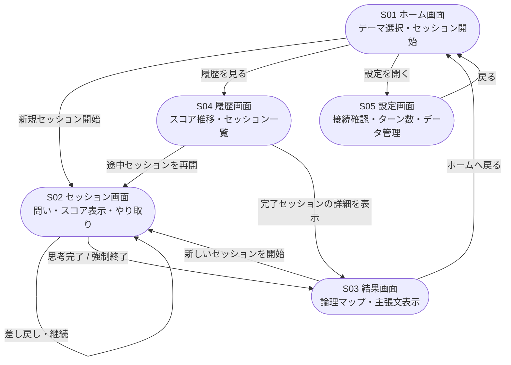

# 外部設計書：論理思考トレーニング『Deep Why』

**バージョン**: 1.3
**最終更新**: 2026-03-21
**対応要件定義**: v3.0

---

## 1. システム概要

本書はDeep Whyのユーザーが直接触れる部分（画面・操作・API）を定義する。内部の処理ロジック・DB設計・プロンプト設計は内部設計書を参照すること。

### 1.1 システム構成

```
ローカルPC（ThinkBook）― 外部送信なし

ユーザー
  ↓ ブラウザ（localhost:3000）
フロントエンド（React + Tailwind CSS）
  ↓ HTTP / JSON（localhost:8000）
バックエンド（FastAPI + LangChain）
  ↓                    ↓
Ollama              SQLite / ChromaDB
（localhost:11434）  （ローカルファイル）
```

### 1.2 起動方法

```bash
# 事前にOllamaを起動しておくこと
ollama serve

# 別ターミナルで start.sh を実行（FastAPI・Reactを起動）
./start.sh

# 内部では以下が順番に実行される
# 1. Ollama接続確認（未起動の場合はメッセージを表示して終了）
# 2. python backend/main.py（FastAPI起動）
# 3. npm run dev --prefix frontend（React起動）
```

---

## 2. 画面一覧

| 画面ID | 画面名 | 役割 |
|:--|:--|:--|
| S01 | ホーム画面 | テーマカテゴリ選択・セッション開始・成長ステータス・過去セッション一覧 |
| S02 | セッション画面 | メインのやり取り・スコア表示・問い返却 |
| S03 | 結果画面 | 論理マップ・主張文・スコア推移の表示 |
| S04 | 履歴画面 | 過去セッションの一覧・長期スコア推移グラフ |
| S05 | 設定画面 | Ollama接続確認・ターン数設定・データ管理 |

---

## 3. 画面遷移図



---

## 4. 画面設計

### S01 ホーム画面

#### 画面構成

```
┌─────────────────────────────────────┐
│ Deep Why              [履歴] [設定] │  ← ナビゲーションバー
├─────────────────────────────────────┤
│  今日は何について深めますか？        │
│  [テーマカテゴリを選ぶ ▼]           │  ← テーマカテゴリ選択
│  [テキスト入力エリア    ] [開始 →]  │  ← 自由入力＋開始ボタン
├─────────────────────────────────────┤
│  あなたの思考の成長                 │
│  [直近の平均スコア] [最も伸びた指標] [連続セッション日数] │  ← 成長ステータス
├─────────────────────────────────────┤
│  過去のセッション                   │
│  [途中] タスク分解の考え方     [再開] │
│  [完了] 自分の強みとは何か     [詳細] │
│  [完了] なぜ報連相が苦手なのか [詳細] │  ← 過去セッション一覧（直近3件）
│  もっと見る →                       │
└─────────────────────────────────────┘
```

#### 各要素の仕様

| 要素 | 仕様 |
|:--|:--|
| テーマカテゴリ選択 | ドロップダウン。技術・タスク・コミュニケーション・キャリア・価値観・自由入力の6種類 |
| テキスト入力 | 必須。カテゴリ選択後にプレースホルダーがカテゴリに応じた例文に変わる |
| 開始ボタン | テキスト入力が空の場合はdisabled |
| 成長ステータス | 直近5セッションの平均スコア・最も伸びた指標・連続セッション日数を表示。3セッション未満は「データ蓄積中...」と表示 |
| 過去セッション一覧 | 直近3件を表示。途中セッションを最上部に表示。「もっと見る」でS04へ遷移 |
| 途中カード | 「再開」ボタンでS02へ遷移 |
| 完了カード | 「詳細」ボタンでS03へ遷移（読み取り専用） |

#### テーマカテゴリ別プレースホルダー例

| カテゴリ | プレースホルダー |
|:--|:--|
| 技術・スキル | 例：自分が得意な技術領域はどこか |
| タスク・業務 | 例：このタスクをどう分解するか |
| コミュニケーション | 例：あの報連相はなぜうまくいかなかったか |
| キャリア・強み | 例：自分はどんなエンジニアになりたいか |
| 価値観 | 例：どんな仕事にやりがいを感じるか |
| 自由入力 | 例：今日深めたいことを入力してください |

---

### S02 セッション画面

#### 画面構成

```
┌─────────────────────────────────────┐
│ ← 戻る  タスク分解の考え方   2 / 5 │  ← ナビゲーションバー（ターン表示）
├─────────────────────────────────────┤
│ 思考スコア（採点ごとに更新）         │
│ 具体性  ████░░░░░░  0.40            │
│ 因果性  ██████░░░░  0.60            │
│ 定義度  ███░░░░░░░  0.30 ◀ 最低     │  ← スコアバーエリア
│ 「定義度が低いです。〇〇という...」  │  ← 採点理由
├─────────────────────────────────────┤
│ [システム] セッションを開始します。  │
│                                     │
│     [ユーザー] タスクを渡されたとき │  ← 会話エリア（スクロール）
│               何から始めればいいか  │
│               わからない           │
│                                     │
│ [Deep Why] 「何から始めればいい     │
│            かわからない」とは、具体  │
│            的にどんな場面ですか？   │  ← AIの問い（紫枠）
│ 採点: 具体性0.10 / 因果性0.10 / ... │  ← 採点バッジ
├─────────────────────────────────────┤
│ [テキスト入力エリア（複数行）] [送信]│  ← 入力エリア
└─────────────────────────────────────┘
```

#### 各要素の仕様

| 要素 | 仕様 |
|:--|:--|
| ナビバーのターン表示 | 「現在ターン / max_turns」形式で表示。例：「2 / 5」 |
| スコアバー | 送信ごとに更新。最低指標を赤色でハイライト |
| 採点理由 | スコアバーの下に1文で表示 |
| 会話エリア | ユーザー発言は右寄せ、AIの問いは左寄せ・紫枠で表示。問いタイプ（垂直深掘り等）はユーザーには非表示 |
| 採点バッジ | 各ターンのAIの問いの直下に小さく表示。スコア3指標と採点理由を1行で表示 |
| 待機中の表示 | 送信後20〜60秒、スコアバーがアニメーション。入力欄はdisabled |
| テキスト入力 | Enter単体で送信、Shift+Enterで改行 |
| 「← 戻る」 | 途中離脱。確認ダイアログを表示し、OKでSQLiteにstatus='abandoned'で保存してS01へ。ダイアログの文言：「これまでの思考プロセスは保存されますが、セッションは中断されます。戻りますか？」 |

---

### S03 結果画面

#### 画面構成

```
┌─────────────────────────────────────┐
│          思考完了                   │  ← ナビゲーションバー
├─────────────────────────────────────┤
│ ✓「タスク分解の考え方」の思考が完了  │
│   5ターン　所要時間 約12分           │
│   最終スコア平均 0.71               │  ← 完了バナー
├─────────────────────────────────────┤
│ あなたの結論               [コピー] │
│ 「タスクの全体像が見えていない状態   │
│   で着手することが、見積もりの      │
│   ズレと迷走の根本原因である。」    │  ← 主張文エリア（先行表示）
├─────────────────────────────────────┤
│ 論理マップ            [全画面で見る]│
│ （Mermaidグラフ）                   │  ← 論理マップエリア
├─────────────────────────────────────┤
│ スコア推移                          │
│ （折れ線グラフ　3指標）             │  ← スコア推移グラフ
├─────────────────────────────────────┤
│ [ホームへ戻る]  [新しいセッションを開始] │  ← アクションボタン
└─────────────────────────────────────┘

【ローディング状態（Mermaid生成中）】
┌─────────────────────────────────────┐
│          思考完了                   │  ← ナビゲーションバー
├─────────────────────────────────────┤
│ ✓「タスク分解の考え方」の思考が完了  │
│   5ターン　所要時間 約12分           │
│   最終スコア平均 0.71               │  ← 完了バナー（先行表示）
├─────────────────────────────────────┤
│ あなたの結論               [コピー] │
│ 「タスクの全体像が見えていない状態   │
│   で着手することが、見積もりの      │
│   ズレと迷走の根本原因である。」    │  ← 主張文（先行表示・読める状態）
├─────────────────────────────────────┤
│  🔄 論理マップを生成しています...   │
│     しばらくお待ちください          │  ← 論理マップエリアのみローディング
│     （30秒程度かかる場合があります）│
└─────────────────────────────────────┘
```

#### 各要素の仕様

| 要素 | 仕様 |
|:--|:--|
| 完了バナー | ターン数・所要時間・最終平均スコアを表示。強制終了時は「現時点の最善として出力しました」と表示 |
| 主張文（あなたの結論） | LLMが全ターンのユーザー発言を要約して生成。ターンAPIの `completed` レスポンスに含まれる `claim` を使用するため、Mermaid生成完了を待たず先行表示する。コピーボタンでクリップボードにコピー可能 |
| ローディング表示 | 主張文表示後、Mermaid生成完了まで論理マップエリアのみ「論理マップを生成しています...（30秒程度かかる場合があります）」を表示。スコア推移・アクションボタンはMermaid生成完了後に表示する |
| 論理マップ | `GET /sessions/{session_id}/result` で取得したMermaidグラフで描画。「全画面で見る」でモーダル拡大表示 |
| スコア推移グラフ | セッション内のターンごとの3指標折れ線グラフ。Chart.jsで描画 |
| 「ホームへ戻る」 | S01へ遷移 |
| 「新しいセッションを開始」 | S01のテーマ入力にフォーカスした状態で遷移 |

---

### S04 履歴画面

#### 画面構成

```
┌─────────────────────────────────────┐
│ ← 戻る     履歴・成長記録           │  ← ナビゲーションバー
├─────────────────────────────────────┤
│ [総セッション数] [平均スコア] [最も伸びた指標] │  ← サマリーカード
├─────────────────────────────────────┤
│ スコア推移（セッション別）           │
│ [全指標][具体性][因果性][定義度]     │  ← タブ切り替え
│ （折れ線グラフ）                    │  ← 長期推移グラフ
├─────────────────────────────────────┤
│ テーマカテゴリ分布                  │
│ （棒グラフ　カテゴリ別セッション数） │  ← カテゴリ分布グラフ
├─────────────────────────────────────┤
│ セッション一覧                      │
│ [すべて][完了][途中]                │  ← フィルタータブ
│ [途中] タスク分解の考え方  [再開][…]│
│ [完了] 自分の強みとは何か  [詳細][…]│  ← セッションカード
│ ← 前へ　1 / 4　次へ →              │  ← ページネーション
└─────────────────────────────────────┘
```

#### 各要素の仕様

| 要素 | 仕様 |
|:--|:--|
| サマリーカード | S01の成長ステータスと同じデータ。全セッション対象 |
| 長期推移グラフ | 横軸はセッション番号。タブで指標を絞り込み可能。Chart.jsで描画 |
| テーマカテゴリ分布 | カテゴリ別のセッション数を棒グラフで表示。思考の偏りを把握するために使用 |
| フィルタータブ | すべて・完了・途中の3種類 |
| セッションカード | ステータス・テーマ・日付・ターン数・平均スコアを表示 |
| 「再開」ボタン | 途中セッションのみ表示。S02へ遷移 |
| 「詳細」ボタン | 完了セッションのみ表示。S03へ遷移（読み取り専用） |
| 「…」メニュー | 削除などのサブアクション。削除時は確認ダイアログを表示 |
| ページネーション | 1ページあたり10件表示 |

---

### S05 設定画面

#### 画面構成

```
┌─────────────────────────────────────┐
│ ← 戻る          設定               │  ← ナビゲーションバー
├─────────────────────────────────────┤
│ Ollama 接続状態                     │
│ ● 接続中  localhost:11434          │
│   Qwen2.5-7B  応答時間 約18秒      │  ← 正常時
│ ━━━━━━━━━━━━━━━━━━━━━━━━━━━━━━━━━━━ │
│ ● 未接続                           │
│   ターミナルで ollama serve を実行  │  ← 異常時（赤表示）
│                       [再確認]      │
├─────────────────────────────────────┤
│ セッション設定                      │
│ 最低往復回数（min_turns）  [3] 回   │
│ この回数を満たすまで終了判定しません│
│ ─────────────────────────────────── │
│ 最大往復回数（max_turns）  [5] 回   │
│ この回数で強制終了します            │
├─────────────────────────────────────┤
│ スコア閾値                          │
│ 現在の閾値  0.50                   │
│ 自動調整方式：成長追従型（変更不可）│
├─────────────────────────────────────┤
│ データ管理                          │
│ 保存場所  ./data/                   │
│ データ容量  SQLite 2.4MB / ChromaDB 8.1MB │
│ ─────────────────────────────────── │
│ [全データを削除]（削除後は復元不可） │
└─────────────────────────────────────┘
```

#### 各要素の仕様

| 要素 | 仕様 |
|:--|:--|
| 接続状態 | アプリ起動時に自動確認。緑（接続中）・赤（未接続）で表示。「再確認」で手動再チェック |
| 未接続時の表示 | 「ollama serve を実行してください」というコマンドを画面上に表示 |
| min_turns | 数値入力フィールド。1〜max_turnsの範囲でバリデーション |
| max_turns | 数値入力フィールド。min_turns〜10の範囲でバリデーション |
| スコア閾値 | 表示のみ。手動変更不可。自動調整の仕組みを1文で説明 |
| 全データを削除 | 確認ダイアログを挟む（「削除すると復元できません。本当に削除しますか？」）。削除後はS01へ遷移 |

---

## 5. API定義

バックエンド（FastAPI）が提供するエンドポイントの一覧。

### 5.1 セッション系

| メソッド | エンドポイント | 概要 |
|:--|:--|:--|
| POST | `/sessions` | 新規セッション作成 |
| GET | `/sessions` | セッション一覧取得 |
| GET | `/sessions/{session_id}` | 特定セッションの詳細取得 |
| PATCH | `/sessions/{session_id}` | セッションのステータス更新（途中離脱等） |
| DELETE | `/sessions/{session_id}` | セッション削除。SQLiteのレコードに加え、ChromaDB上の付随するベクトルデータも同時に削除する |

**POST `/sessions` リクエスト例**
```json
{
  "topic": "タスク分解の考え方",
  "category": "task"
}
```

**POST `/sessions` レスポンス例**
```json
{
  "session_id": "uuid-xxxx",
  "status": "active",
  "threshold": 0.50,
  "min_turns": 3,
  "max_turns": 5,
  "created_at": "2026-03-17T10:00:00"
}
```

### 5.2 ターン系

| メソッド | エンドポイント | 概要 |
|:--|:--|:--|
| POST | `/sessions/{session_id}/turns` | ユーザー入力を送信し、採点・問い生成を実行 |
| GET | `/sessions/{session_id}/turns` | セッション内の全ターン取得 |
| GET | `/sessions/{session_id}/result` | セッション完了後の論理マップを取得（Mermaid生成完了後に返却） |

**POST `/sessions/{session_id}/turns` リクエスト例**
```json
{
  "user_input": "タスクを渡されたとき何から始めればいいかわからない"
}
```

**POST `/sessions/{session_id}/turns` レスポンス例（継続時）**
```json
{
  "turn_number": 1,
  "scores": {
    "concreteness": 0.10,
    "causality": 0.10,
    "definitiveness": 0.20,
    "reason": "時期・原因・定義がすべて曖昧で具体的な情報がない"
  },
  "question_type": "vertical",
  "ai_question": "「何から始めればいいかわからない」とは、具体的にどんな場面ですか？",
  "status": "active",
  "count": 1
}
```

**POST `/sessions/{session_id}/turns` レスポンス例（完了時）**

`claim`（主張文）はこのレスポンスで返却する。`logic_map`（論理マップ）はMermaid生成に時間がかかるため、別途 `GET /sessions/{session_id}/result` で取得する。

```json
{
  "turn_number": 4,
  "scores": {
    "concreteness": 0.75,
    "causality": 0.72,
    "definitiveness": 0.70,
    "reason": "具体的な状況と根拠が明確に述べられている"
  },
  "status": "completed",
  "claim": "タスクの全体像が見えていない状態で着手することが、見積もりのズレと迷走の根本原因である。",
  "count": 4
}
```

**GET `/sessions/{session_id}/result` レスポンス例**

```json
{
  "session_id": "uuid-xxxx",
  "logic_map": "graph TD\n  A[タスクを渡された] --> B[全体像が見えない]\n  B --> C[とりあえず着手]\n  C --> D[見積もりがズレる]\n  D --> E[結論：全体像の把握が先決]",
  "status": "ready"
}
```

Mermaid生成中は `status: "generating"` を返す。フロントエンドはポーリングで完了を確認する。

### 5.3 統計・成長記録系

| メソッド | エンドポイント | 概要 |
|:--|:--|:--|
| GET | `/stats/summary` | 成長ステータスサマリー取得（S01・S04用） |
| GET | `/stats/score-history` | 長期スコア推移取得（S04グラフ用） |
| GET | `/stats/category-distribution` | テーマカテゴリ分布取得（S04グラフ用） |

**GET `/stats/summary` レスポンス例**
```json
{
  "total_sessions": 12,
  "recent_avg_score": 0.68,
  "best_growth_metric": "causality",
  "best_growth_delta": 0.18,
  "streak_days": 5
}
```

### 5.4 設定系

| メソッド | エンドポイント | 概要 |
|:--|:--|:--|
| GET | `/settings` | 設定値取得 |
| PATCH | `/settings` | 設定値更新（min_turns・max_turnsのみ変更可） |
| GET | `/health/ollama` | Ollama接続確認 |
| DELETE | `/data` | 全データ削除 |

**GET `/health/ollama` レスポンス例（正常時）**
```json
{
  "status": "connected",
  "model": "qwen2.5:7b",
  "response_time_sec": 18.2
}
```

**GET `/health/ollama` レスポンス例（異常時）**
```json
{
  "status": "disconnected",
  "message": "Ollamaが起動していません。ターミナルで ollama serve を実行してください。"
}
```

---

## 6. エラー・ローディング状態の仕様

| 状況 | 表示内容 |
|:--|:--|
| Ollama未接続でセッション開始しようとした | トースト通知「Ollamaが起動していません。設定画面を確認してください。」 |
| LLMのJSON出力が崩れた（リトライ中） | スコアバーのアニメーションを継続。ユーザーには通知しない（最大2回リトライ） |
| リトライ2回後も失敗 | トースト通知「採点に失敗しました。もう一度送信してください。」 |
| セッション完了後のMermaid生成中 | S03に遷移し完了バナーと主張文（あなたの結論）を先行表示した後、論理マップエリアのみ「論理マップを生成しています...（30秒程度かかる場合があります）」のローディング表示。スコア推移・アクションボタンはMermaid生成完了後に表示 |
| セッション途中でページを閉じようとした | ブラウザの離脱確認ダイアログを表示 |
| ThinkBookの高負荷時（CPU使用率90%超） | 「処理に時間がかかっています...」をスコアバー下に表示 |

---

## 変更管理

| バージョン | 更新日 | 項番 | 変更種別 | 変更内容 |
|:--|:--|:--|:--|:--|
| 1.0 | 2026-03-17 | 全体 | 新規作成 | 初版作成。画面一覧・画面遷移図・画面設計（S01〜S05）・API定義・エラー仕様を記述。要件定義v3.0（エンジニア特化）に対応 |
| 1.1 | 2026-03-18 | §4 S02 | 修正 | 会話エリアの開始メッセージから不要な文言「テーマについて話してください」を削除 |
| 1.1 | 2026-03-18 | §4 S03 | 修正 | 主張文エリアのラベルを「磨き上げられた主張文」から「あなたの結論」に変更 |
| 1.2 | 2026-03-21 | §1.2 | 修正 | 起動方法をOllama事前起動前提に変更。start.shはFastAPI・Reactのみ起動する旨を明記 |
| 1.2 | 2026-03-21 | §4 S03 | 追記 | 画面構成にMermaid生成中のローディング状態を追加 |
| 1.2 | 2026-03-21 | §4 S03 | 追記 | 各要素の仕様にローディング表示の仕様を追加（完了バナー先行表示・Mermaid生成完了後に全要素を表示） |
| 1.2 | 2026-03-21 | §6 | 追記 | エラー・ローディング状態にMermaid生成中の表示仕様を追加 |
| 1.3 | 2026-03-21 | §4 S02 | 修正 | 「← 戻る」確認ダイアログの文言を追記（「これまでの思考プロセスは保存されますが、セッションは中断されます。戻りますか？」） |
| 1.3 | 2026-03-21 | §4 S03 | 修正 | 主張文を先行表示する設計に変更。論理マップエリアのみローディング状態にするよう画面構成・仕様を更新 |
| 1.3 | 2026-03-21 | §5.1 | 修正 | DELETEエンドポイントの概要にChromaDBのベクトルデータも同時削除する旨を追記 |
| 1.3 | 2026-03-21 | §5.2 | 追記 | `GET /sessions/{session_id}/result` エンドポイントを追加。completedレスポンスから `logic_map` を分離しポーリング方式に変更 |
| 1.3 | 2026-03-21 | §6 | 修正 | Mermaid生成中のローディング表示を「主張文先行表示・論理マップエリアのみローディング」に更新 |