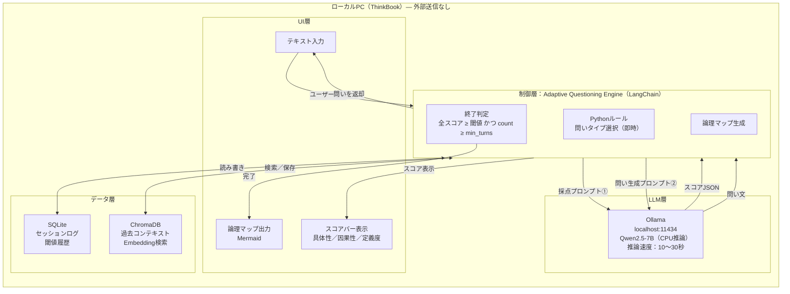
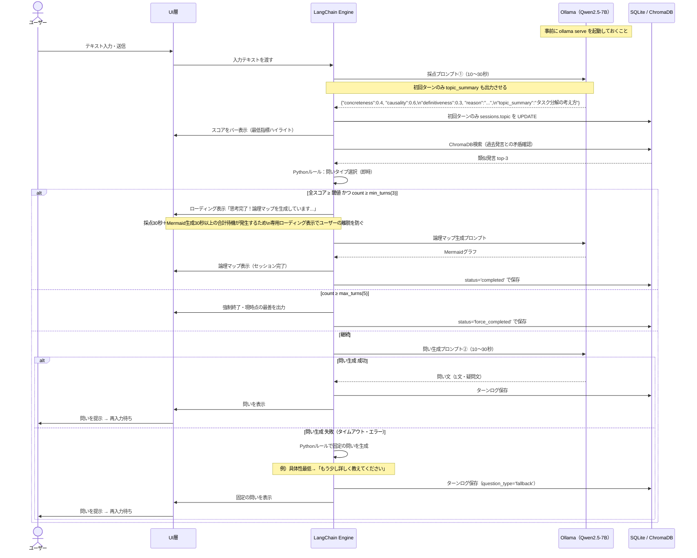
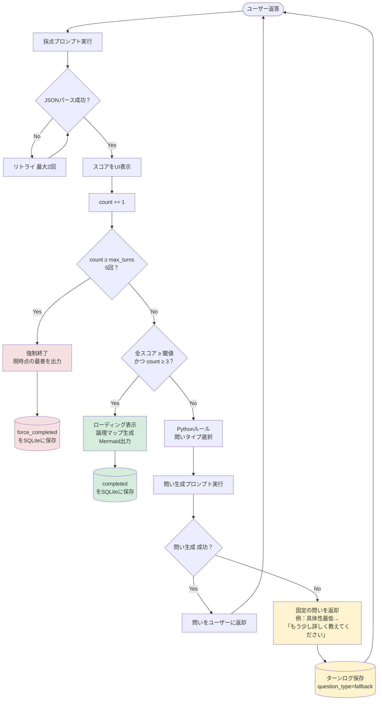
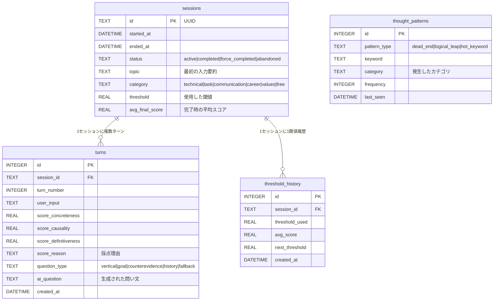
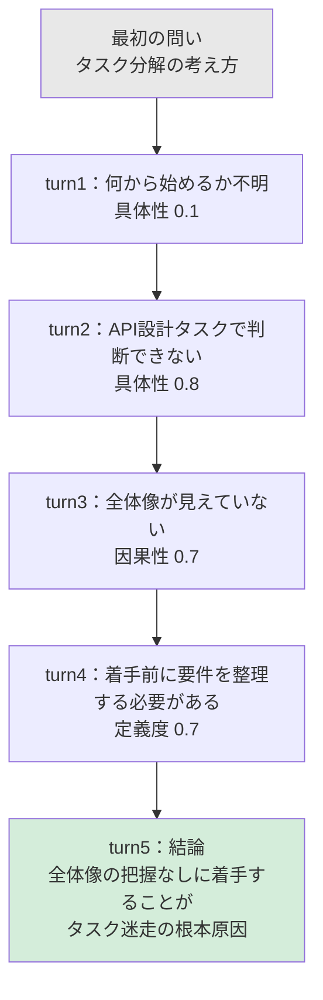

# 内部設計書：論理思考トレーニング『Deep Why』
**バージョン**: 3.2（レビュー指摘3点を反映）
**最終更新**: 2026-03-21

---

## 1. 設計決定事項 一覧

| 項目 | 決定内容 |
|:--|:--|
| スコアリング実装方針 | LLMプロンプト採点（送信後に実行） |
| LLM呼び出し戦略 | 案C：採点のみLLM → Pythonルールで問いタイプ決定 → LLMで問い文生成（計2回） |
| スコアのUI表示 | 表示する（具体性・因果性・定義度をバー表示＋採点理由を1文表示） |
| スコア閾値 | 成長追従型・自動調整（初期値 0.5、セッション平均スコアに応じて引き上げ） |
| min_turns / max_turns | min=3、max=5（固定） |
| 論理マップ出力形式 | Mermaid ビジュアルグラフ |
| 使用モデル | Qwen2.5-7B（Alibaba・Apache 2.0・日本語対応） |
| Vector DB | ChromaDB（LangChain公式対応・ローカルファイル保存） |
| セッション途中離脱 | 途中保存可能。セッションIDで再開できる |
| LLM実行環境 | ローカルPC（Ollama経由・完全ローカル動作） |
| データ保存場所 | ローカルPC（SQLite・ChromaDB）。外部送信なし |
| 想定月額コスト | $0（電気代のみ） |
| フロントエンド | React + Tailwind CSS（localhost:3000） |
| バックエンド | FastAPI（Python）（localhost:8000） |
| テーマカテゴリ | 技術・タスク・コミュニケーション・キャリア・価値観・自由入力の6種類。セッション開始時に選択しSQLiteに保存 |
| 将来課題（優先度低） | パッケージリリース・SEO対策（将来フェーズで設計） |

---

## 2. 全体アーキテクチャ

> 完全ローカル構成。外部への通信は一切なし。



---

## 3. 処理フロー詳細

### 3.1 1ターンあたりのシーケンス図



### 3.2 終了判定フローチャート



### 3.3 問いタイプ選択ロジック（Pythonルール）

```python
def select_question_type(scores: dict, session_id: str) -> str:
    # 過去ログに矛盾がある場合は優先してhistoryタイプ
    if has_contradiction_in_history(session_id):
        return "history"

    weakest = min(scores, key=scores.get)
    mapping = {
        "concreteness":   "vertical",        # 垂直深掘り
        "causality":      "counterevidence", # 反証提示
        "definitiveness": "goal",            # 目的回帰
    }
    return mapping[weakest]
```

### 3.4 待ち時間について

通常ターンの合計待ち時間は20〜60秒（LLM呼び出し2回分）。思考の間合いとして設計上許容する。待機中はスコアバーをアニメーション表示して処理中であることを示す。

セッション完了時は採点（最大30秒）＋Mermaid生成（最大30秒以上）が直列で発生し、合計1分を超える場合がある。このため専用のローディング表示（「思考完了！論理マップを生成しています...」）を設けてユーザーの離脱を防ぐ（外部設計書 §4 S03参照）。

---

## 4. Insight Analyzer 詳細

### 4.1 採点プロンプト（LLM呼び出し①）

```
[SYSTEM]
あなたはエンジニア向け論理思考トレーニングの採点官です。
ユーザーの入力を以下の3指標で採点し、必ずJSONのみで返答してください。
前後の説明文・Markdownコードブロック等は一切出力しないこと。

■ セッションのテーマカテゴリ
{category}
（技術・スキル / タスク・業務 / コミュニケーション / キャリア・強み / 価値観 / 自由入力）

■ 採点指標
- concreteness（具体性）: 0.0〜1.0
  5W1H・数値・固有名詞・時期・技術名・ツール名の含有率。
  「なんとなく」「うまくいかない」等の曖昧語は減点。

- causality（因果性）: 0.0〜1.0
  主張に対し根拠が論理的に接続されているか。
  感情による断定・論理の飛躍・「〜だと思う」のみの主張は減点。

- definitiveness（定義度）: 0.0〜1.0
  独自の意味を持つ言葉（概念語・技術用語）が客観的に説明されているか。
  未定義の抽象語・業界用語の無説明使用は減点。

■ 出力フォーマット（厳守）

初回ターン（turn_number=1）の場合：
{
  "concreteness": 0.00,
  "causality": 0.00,
  "definitiveness": 0.00,
  "reason": "採点理由を1文で（日本語）",
  "topic_summary": "セッションのテーマを10文字以内で要約"
}

2回目以降のターンの場合：
{
  "concreteness": 0.00,
  "causality": 0.00,
  "definitiveness": 0.00,
  "reason": "採点理由を1文で（日本語）"
}

■ 出力例（Few-shot）
入力：「タスクをどう進めればいいかわからない」
出力：{"concreteness": 0.10, "causality": 0.10, "definitiveness": 0.15, "reason": "どのタスクか・何がわからないかの具体情報がなく、原因も述べられていない"}

入力：「先週アサインされたAPI設計タスクで、既存DBのスキーマを変更すべきか新規テーブルを追加すべきか判断できず、レビュー前日まで着手できなかった」
出力：{"concreteness": 0.80, "causality": 0.72, "definitiveness": 0.60, "reason": "時期・タスク内容・判断の迷いは明確だが『判断できない』の定義と根拠がやや曖昧"}

入力：「自分の強みはコミュニケーション力だと思う」
出力：{"concreteness": 0.10, "causality": 0.10, "definitiveness": 0.15, "reason": "『コミュニケーション力』の定義がなく、根拠となる具体的な経験・場面が述べられていない"}

[USER]
{ユーザー入力テキスト}
```

> **7Bモデル向けの注意点**：Few-shotサンプルを必ず含めることでJSON出力の安定性が大幅に向上する。出力がJSON以外の形式になった場合はPython側でリトライ処理（最大2回）を実装すること。カテゴリ情報（`{category}`）はセッション開始時に確定した値を毎ターン渡す。Few-shotの実データは `data/config/few_shots.json` で管理しgit管理外とする（開発ルール §3 参照）。

### 4.2 スコアUI表示仕様

```
┌────────────────────────────────────┐
│ 具体性    ████░░░░░░  0.40         │
│ 因果性    ██████░░░░  0.60         │
│ 定義度    ███░░░░░░░  0.30  ◀ 最低 │
│                                    │
│ 「使っている言葉の意味をもう少し   │
│   具体的に説明してみてください」   │
└────────────────────────────────────┘
```

- 0〜1をプログレスバーで可視化
- 最低指標をハイライト表示
- `reason` を1文で表示（差し戻し理由の透明化）

---

## 5. スコア閾値 自動調整設計

### 5.1 方針：成長追従型

ユーザーの思考力の成長に合わせて閾値を引き上げ、**常に「少し背伸びが必要なライン」を維持する**。

### 5.2 調整アルゴリズム

```python
INITIAL_THRESHOLD = 0.50   # 初回セッションの閾値
ADJUSTMENT_RATE   = 0.05   # 1セッションあたりの最大引き上げ幅
MAX_THRESHOLD     = 0.85   # 上限（これ以上は上げない）
MIN_THRESHOLD     = 0.40   # 下限（成長が止まっても下げすぎない）

def calc_next_threshold(history: list[dict]) -> float:
    """
    直近Nセッションの完了時平均スコアを元に次回閾値を算出。
    平均スコアが現在閾値を上回っていれば閾値を引き上げる。
    """
    if len(history) < 3:
        return INITIAL_THRESHOLD  # セッション数が少ない間は初期値を維持

    recent = history[-5:]  # 直近5セッションを参照
    avg_score = mean([s["avg_final_score"] for s in recent])
    current_threshold = history[-1]["threshold"]

    if avg_score > current_threshold:
        delta = min((avg_score - current_threshold) * 0.5, ADJUSTMENT_RATE)
        new_threshold = min(current_threshold + delta, MAX_THRESHOLD)
    else:
        new_threshold = max(current_threshold - ADJUSTMENT_RATE, MIN_THRESHOLD)

    return round(new_threshold, 2)
```

### 5.3 閾値の推移イメージ

| セッション数 | 想定平均スコア | 閾値 |
|:--:|:--:|:--:|
| 1〜3回 | 0.40〜0.55 | 0.50（固定） |
| 5回 | 0.60 | 0.55 |
| 10回 | 0.70 | 0.63 |
| 20回 | 0.78 | 0.72 |
| 30回以上 | 0.82 | 0.80（上限付近） |

---

## 6. Adaptive Questioning Engine 詳細

### 6.1 問いタイプと生成プロンプト（LLM呼び出し②）

| タイプ | 発動条件 | 問いの方向性 |
|:--|:--|:--|
| 垂直深掘り（vertical） | concreteness が最低 | いつ・どこで・誰が・どのくらい |
| 目的回帰（goal） | definitiveness が最低 | その言葉・概念の自分なりの定義 |
| 反証提示（counterevidence） | causality が最低 | 逆の場合・例外・反例の検討 |
| 過去ログ参照（history） | ChromaDB検索で矛盾発見時 | 過去の発言との整合性の確認。ただしLLMが矛盾なしと判断した場合は通常の深掘りを行う |

```
[SYSTEM]
あなたはエンジニア向け論理思考トレーニングのコーチです。
以下の情報を元に、ユーザーの思考を深めるための「問い」を1つだけ生成してください。
問いは短く・鋭く・答えやすい形（疑問文）にすること。説明や前置きは不要。
エンジニアの業務文脈（技術・タスク・キャリア等）に即した問いにすること。
単に事実を確認する問いではなく、ユーザーが思考の前提を問い直すきっかけになる問いにすること。

テーマカテゴリ: {category}
問いタイプ: {question_type}
ユーザーの直近の発言: {user_input}
最低スコアの指標: {weakest}
採点理由: {reason}
過去の類似発言（historyタイプのみ）: {past_utterance}

[historyタイプの場合の追加指示]
上記の過去の発言と現在の発言を比較し、矛盾・変化・深化があれば、それを指摘する問いを生成してください。
もし過去の発言と現在の発言に矛盾がないと判断した場合は、historyタイプを無視して通常の深掘り（垂直深掘り）を行ってください。

[出力]
問い文のみ（1文・疑問文）
```

### 6.2 往復回数管理

```python
session_state = {
    "session_id":  str,       # UUID
    "count":       int,       # 現在の往復回数（0始まり）
    "min_turns":   3,         # 最低往復回数（固定）
    "max_turns":   5,         # 上限往復回数（固定）
    "threshold":   float,     # 今セッションの閾値（セッション開始時に確定）
    "scores_history": list,   # 全ターンのスコア履歴
    "status":      str,       # 'active' | 'completed' | 'force_completed' | 'abandoned'
}
```

---

## 7. データ層設計

### 7.1 ER図



### 7.2 SQLiteスキーマ（DDL）

```sql
-- セッション管理
CREATE TABLE sessions (
    id                TEXT PRIMARY KEY,         -- UUID
    started_at        DATETIME,
    ended_at          DATETIME,
    status            TEXT,                     -- 'active'|'completed'|'force_completed'|'abandoned'
    topic             TEXT,                     -- 最初のユーザー入力（要約）
    category          TEXT,                     -- 'technical'|'task'|'communication'|'career'|'values'|'free'
    threshold         REAL,                     -- このセッションで使用した閾値
    avg_final_score   REAL                      -- セッション終了時の平均スコア（閾値調整に使用）
);

-- ターンごとのログ
CREATE TABLE turns (
    id                      INTEGER PRIMARY KEY AUTOINCREMENT,
    session_id              TEXT REFERENCES sessions(id),
    turn_number             INTEGER,
    user_input              TEXT,
    score_concreteness      REAL,
    score_causality         REAL,
    score_definitiveness    REAL,
    score_reason            TEXT,               -- LLMの採点理由
    question_type           TEXT,               -- 選択された問いタイプ（fallbackを含む）
    ai_question             TEXT,               -- 生成された問い文
    created_at              DATETIME
);

-- 思考パターン蓄積（パーソナライズ用）
CREATE TABLE thought_patterns (
    id            INTEGER PRIMARY KEY AUTOINCREMENT,
    pattern_type  TEXT,    -- 'dead_end'|'logical_leap'|'hot_keyword'
    keyword       TEXT,
    category      TEXT,    -- 発生したカテゴリ（カテゴリ別の傾向分析に使用）
    frequency     INTEGER DEFAULT 1,
    last_seen     DATETIME
);

-- 閾値履歴（成長追従型の調整ログ）
CREATE TABLE threshold_history (
    id             INTEGER PRIMARY KEY AUTOINCREMENT,
    session_id     TEXT REFERENCES sessions(id),
    threshold_used REAL,
    avg_score      REAL,
    next_threshold REAL,
    created_at     DATETIME
);
```

### 7.3 ChromaDB 設計

```
コレクション名: user_thoughts

保存単位:  1発言（1ターンのユーザー入力）
メタデータ: {
    session_id:   str,
    turn_number:  int,
    category:     str,   -- テーマカテゴリ（過去ログ参照時のフィルタリングに使用）
    score_avg:    float,
    created_at:   str
}

検索タイミング: 毎ターン、採点後に実行
取得件数（k）:  上位3件
類似度閾値:     0.70以上のみ「矛盾あり」と判定（要チューニング。§10参照）
```

```python
# ChromaDB 利用例（LangChain経由）
from langchain.vectorstores import Chroma
from langchain.embeddings import HuggingFaceEmbeddings

embeddings = HuggingFaceEmbeddings(model_name="intfloat/multilingual-e5-small")
vectorstore = Chroma(
    collection_name="user_thoughts",
    embedding_function=embeddings,
    persist_directory="./chroma_db"
)

# 保存
vectorstore.add_texts(
    texts=[user_input],
    metadatas=[{"session_id": sid, "turn_number": n, "category": cat, "score_avg": avg}]
)

# 検索（過去ログ参照）
results = vectorstore.similarity_search_with_score(user_input, k=3)
contradictions = [r for r, score in results if score >= 0.70]
```

**Embeddingモデル**：`intfloat/multilingual-e5-small` を推奨（日本語対応・軽量・ローカル動作可）

---

## 8. 最終出力：論理マップ（Mermaid）

セッション完了時に、全ターンのユーザー発言とスコア推移から論理マップを生成する。



---

## 9. 技術スタック（確定版）

| コンポーネント | 採用技術 |
|:--|:--|
| フロントエンド | React + Tailwind CSS（localhost:3000） |
| バックエンド | FastAPI（Python）（localhost:8000） |
| エージェント制御 | Python + LangChain |
| LLM | Qwen2.5-7B（Alibaba・Apache 2.0・日本語対応） |
| LLM実行環境 | Ollama（ローカル常駐・localhost:11434） |
| Embeddingモデル | intfloat/multilingual-e5-small（ローカル動作） |
| セッションログ | SQLite（ローカルPC） |
| 過去コンテキスト参照 | ChromaDB（ローカルPC） |
| 論理マップ出力 | Mermaid |
| 起動スクリプト | start.sh（FastAPI・Reactを起動。Ollamaは事前に手動起動しておくことを前提とする） |
| 想定月額コスト | $0（電気代のみ） |
| 将来課題 | パッケージリリース・SEO対策（優先度低・将来フェーズで設計） |

---

## 10. 残課題（実装フェーズで対応）

| 課題 | 内容 |
|:--|:--|
| 推論待ち時間のUX | 1ターンあたり20〜60秒の待機が発生する。スコアバーのアニメーション表示や「考え中...」の文言など、待機中の体験設計が必要 |
| JSON出力の安定性検証 | 7Bモデルでは稀にJSON形式が崩れる。リトライ処理（最大2回）の実装と、それでも失敗した場合のフォールバック処理が必要 |
| ThinkBookの発熱・バッテリー管理 | 長時間のCPU推論は発熱とバッテリー消費を伴う。電源接続時のみ使用を推奨する旨をUIに表示することを検討 |
| Mermaid生成プロンプト設計 | 全ターンの発言から論理マップを生成するプロンプトが未設計 |
| 採点精度の検証 | Qwen2.5-7BとFew-shotの組み合わせで十分な採点精度が得られるかテストが必要。カテゴリ別の精度差も検証する |
| Few-shotサンプルの拡充 | 現在3パターン。カテゴリ（技術・タスク・コミュニケーション・キャリア・価値観）ごとに最低2パターン以上のサンプルを `data/config/few_shots.json` に追加することを推奨 |
| ChromaDB閾値のチューニング | 類似度閾値を0.70から開始し、historyタイプの問いの発動頻度を観察しながら調整する。発動しすぎる場合は引き上げ、発動しない場合は引き下げる |
| UXテスト | 差し戻し体験のフラストレーション許容度の検証。特にmax_turns=5と待ち時間の組み合わせが適切かどうか |
| start.sh作成 | FastAPI・Reactを起動するスクリプトが未実装。Ollamaは事前手動起動を前提とし、起動時に `curl -s http://localhost:11434/api/tags` でOllamaの起動状態を確認する。未起動の場合は「Ollamaが起動していません。起動してから再実行してください」と表示して終了する |
| 外部設計書S03の修正 | Mermaid生成時の専用ローディング表示（「思考完了！論理マップを生成しています...」）をS03の画面仕様に追記する必要あり |
| 将来：パッケージリリース | インストーラー・配布形式・ライセンス設計（優先度低） |
| 将来：SEO対策 | ランディングページ設計・コンテンツ戦略（優先度低） |

---

## 変更管理

| バージョン | 更新日 | 項番 | 変更種別 | 変更内容 |
|:--|:--|:--|:--|:--|
| 1.0 | 2026-03-16 | 全体 | 新規作成 | 初版作成。全体アーキテクチャ・処理フロー・採点プロンプト・SQLiteスキーマ・ChromaDB設計を記述 |
| 1.1 | 2026-03-16 | §1・§2・§3・§9・§10 | 修正 | インフラ構成をEC2スポットインスタンス構成に変更。アーキテクチャ図・処理シーケンス・技術スタック・残課題を更新 |
| 1.2 | 2026-03-16 | §1・§2・§3・§4.1・§9・§10 | 修正 | 完全ローカル構成（Ollama + Qwen2.5-7B）に変更。EC2・boto3関連の設計を削除。採点プロンプトにFew-shotを追加。待ち時間を20〜60秒に更新 |
| 1.3 | 2026-03-17 | §2・§3・§7 | 新規追加 | アーキテクチャ図（Mermaid）・シーケンス図・終了判定フローチャート・ER図を追加。テキストベースの図を置き換え |
| 1.4 | 2026-03-17 | §9 | 削除 | Claude Code（開発補助）を技術スタックから削除 |
| 2.0 | 2026-03-17 | 全体 | ドキュメント種別変更 | ドキュメント名を「詳細設計書」から「内部設計書」に変更。要件定義v3.0（エンジニア特化）との整合対応は次バージョンで実施予定 |
| 3.0 | 2026-03-21 | §1 | 追記 | フロントエンド（React + Tailwind CSS）・バックエンド（FastAPI）・テーマカテゴリ機能を設計決定事項に追加 |
| 3.0 | 2026-03-21 | §4.1 | 修正 | 採点プロンプトをエンジニア特化に更新。カテゴリ文脈（`{category}`）を毎ターン渡す仕組みを追加。Few-shotサンプルをエンジニア業務文脈の3パターンに差し替え |
| 3.0 | 2026-03-21 | §6.1 | 修正 | 問い生成プロンプトにテーマカテゴリ（`{category}`）を追加。エンジニア業務文脈に即した問い生成を明示 |
| 3.0 | 2026-03-21 | §7.1 | 修正 | ER図のsessionsテーブルに `category` カラムを追加。thought_patternsテーブルに `category` カラムを追加 |
| 3.0 | 2026-03-21 | §7.2 | 修正 | SQLiteスキーマのsessions・thought_patternsテーブルに `category` カラムを追加。ChromaDBメタデータに `category` を追加 |
| 3.0 | 2026-03-21 | §9 | 修正 | 技術スタックにFastAPI・React + Tailwind CSS・start.shを追加 |
| 3.1 | 2026-03-21 | §3.1 | 修正 | シーケンス図に初回ターンのtopic_summary生成・問い生成失敗時のフォールバック処理を追加。Ollama事前起動前提の注記に変更 |
| 3.1 | 2026-03-21 | §3.2 | 修正 | フローチャートに問い生成失敗時のフォールバック分岐（固定の問いを返却・question_type=fallback）を追加 |
| 3.1 | 2026-03-21 | §4.1 | 修正 | 採点プロンプトの出力JSONに初回ターンのみ `topic_summary` を追加。sessions.topicの更新タイミングを明確化 |
| 3.1 | 2026-03-21 | §6.1 | 修正 | 問い生成プロンプトに「思考の前提を問い直すきっかけになる問いにすること」を追加 |
| 3.1 | 2026-03-21 | §7.2 | 修正 | ChromaDB類似度閾値を0.85から0.70に変更。コード内の閾値も合わせて更新 |
| 3.1 | 2026-03-21 | §9 | 修正 | start.shの説明をFastAPI・React起動のみ（Ollama事前起動前提）に変更 |
| 3.1 | 2026-03-21 | §10 | 修正 | ChromaDB閾値チューニングを残課題に追加。start.sh残課題の説明をOllama事前起動前提に更新 |
| 3.2 | 2026-03-21 | §3.1 | 修正 | シーケンス図の完了時フローにMermaid生成前の専用ローディング表示を追加 |
| 3.2 | 2026-03-21 | §3.2 | 修正 | フローチャートの論理マップ生成ノードにローディング表示を追記 |
| 3.2 | 2026-03-21 | §3.4 | 追記 | セッション完了時のMermaid生成待機（合計1分超）に関する説明と専用ローディング表示の方針を追記 |
| 3.2 | 2026-03-21 | §6.1 | 修正 | historyタイプの問いタイプ説明にLLM側最終フィルタの説明を追加。問い生成プロンプトにhistoryタイプ用の `{past_utterance}` 変数と最終フィルタ指示を追加 |
| 3.2 | 2026-03-21 | §7.1 | 修正 | ER図のturnsテーブルのquestion_typeに `fallback` を追記 |
| 3.2 | 2026-03-21 | §7.2 | 修正 | SQLiteのturnsテーブルコメントにfallbackを追記 |
| 3.2 | 2026-03-21 | §7.3 | 修正 | ChromaDB保存コードにcategoryをメタデータに追加（漏れていた修正） |
| 3.2 | 2026-03-21 | §8 | 修正 | 論理マップのサンプルをエンジニア特化（タスク分解）の内容に差し替え |
| 3.2 | 2026-03-21 | §10 | 追記 | start.shのOllama確認ロジック（curl確認・未起動時メッセージ）を残課題に追記。外部設計書S03修正を残課題に追加 |